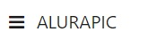

# Especificação Alura Pic

## 1. Definições

O propósito do sistema ***Alura Pic*** é ser uma aplicação em que seus usuários possam fazer upload de fotos..

Os usuários podem se cadastrar para ter acesso a aplicação, o que permitirá que possam fazer o upload de fotos, curtirem suas próprias fotos bem como fazer comentários. Além disso, os usuários podem deletar as fotos postadas de acordo com suas necessidades.

A aplicação conta com funcionalidades para atender a estas expectativas:

1. Criar usuário;
2. Login com usuário cadastrado;
3. Upload de fotos;
4. Gestão da lista de fotos;
5. Favoritar fotos existentes;
6. Comentar fotos existentes;
7. Apagar fotos existentes;
8. Pesquisa de fotos;

[Link para o site](https://alura-fotos.herokuapp.com/#/home)

[Link para o Swagger](xxxx)

## 2. *Users stories* e critérios de aceite utilizados

### 2.1. Criar usuário

| *User story* | Critérios de aceite |
| -----------  | ------------------- |
| **Como** uma pessoa qualquer **Desejo** me registrar no sistema **Para** ter acesso as funcionalidades de upload de fotos | 1. As informações necessárias para cadastrar um usuário são: ``email``, ``nome completo``, ``nome de usuario`` e ``senha``. |
| - | 2. O formato aceito de e-mail segue o padrão `nomeUtilizador@dominio`. Exemplo: ``nome@email.com``. Se o e-mail informado possuir um formato inválido, a operação de registro deverá ser cancelada. |
| - | 3. Não deve ser possível cadastrar um usuário com um nome de usuário já utilizado no cadastro de outro usuário. |
| - | 4. Se houver a tentativa de cadastrar um usuário com nome de usuário já existente, o processo deverá ser bloqueado com a mensagem: ``Username already taken`. |
| - | 5. Não deve ser possível cadastrar um ``email`` com mais de 254 caracteres, sendo que o nome do utilizador deve ter no máximo 64 caracteres excluindo o arroba e o domínio deve ter no máximo 190 caracteres incluindo o arroba. |
| - | 6. Não deve ser possível cadastrar um ``nome completo`` com menos de 2 caracteres ou com mais de 40 caracteres. |
| - | 7. Não deve ser possível cadastrar um ``nome de usuário`` com menos de 2 caracteres ou com mais de 40 caracteres. |
| - | 8. Não deve ser possível cadastrar uma ``senha`` com menos de 8 caracteres ou com mais de 18 caracteres. |

### 2.2. Login com usuário cadastrado

| *User story* | Critérios de aceite |
| -----------  | ------------------- |
| **Como** um usuário com conta no sistema **Desejo** realizar meu acesso na aplicação **Para** conseguir utilizar os serviços do Alura Pic. | 1. O login deve ser feito utilizando informações de ``nome de usuario`` e ``senha`` do cadastro de usuário. |
| - | 2. Caso o ``nome de usuario`` e ``senha`` utilizado no login coincidam com o cadastrado na base de dados, o usuário deve ser autenticado e deve ter acesso às demais funcionalidades. |
| - | 3. Caso o ``nome de usuario`` ou ``senha`` utilizado no login não coincidam com o cadastrado na base de dados, a operação de login deve ser recusada. |

### 2.3. Upload de fotos

| *User story* | Critérios de aceite |
| -----------  | ------------------- |
| **Como** um usuário com conta no sistema **Desejo** realizar o upload de fotos **Para** visualizar as fotos no sistema. | 1. O usuário precisa estar logado para realizar o upload de fotos. |
| - | 2. O usuário deve ser capaz de realizar o upload de uma foto por vez. |
| - | 3. Deve ser possível que o usuário escreva uma descrição na foto antes de realizar o upload com um limite de 300 caracteres. |
| - | 4. O usuário deve ser capaz de permitir ou não o comentário em suas fotos. |
| - | 5. O usuário deve ser capaz de cancelar o upload de uma foto. Caso o faça, o usuário deve ser redirecionado para a tela inicial do sistema. |

### 2.4. Gestão de lista de fotos

| *User story* | Critérios de aceite |
| -----------  | ------------------- |
| **Como** um usuário com conta no sistema **Desejo** gerenciar a lista de fotos **Para** visualizar as fotos no sistema. | 1. O usuário precisa estar logado para realizar a gestão da lista de fotos. |
| - | 2. As fotos devem ser apresentadas na tela de acordo com a ordem descresente de upload, ou seja, as últimas fotos que foram carregadas no sistema devem ser as primeiras a serem exibidas na lista de fotos. |
| - | 3. Na tela inicial do sistema devem ser apresentadas até 12 fotos. |
| - | 4. Deve ser possível que o usuário carregue as próximas fotos em grupos de 12. |
| - | 5. O usuário somente pode visualizar as suas próprias fotos |

### 2.5. Favoritar fotos existentes

| *User story* | Critérios de aceite |
| -----------  | ------------------- |
| **Como** um usuário com conta no sistema **Desejo** favoritar as fotos existentes  **Para** que fique registrado quais são minhas fotos favoritas. | 1. O usuário precisa estar logado para curtir as fotos existentes. |
| - | 2. O usuário somente pode curtir a sua própria foto uma vez. |
| - | 3. Deve ser apresentado na tela do sistema a quantidade de curtidas de cada foto. |
| - | 4. Após curtir uma foto, o usuário não tem a opção de descurtir a mesma foto. |

### 2.6. Comentar fotos existentes

| *User story* | Critérios de aceite |
| -----------  | ------------------- |
| **Como** um usuário com conta no sistema **Desejo** comentar as fotos existentes **Para** que fique registrado quais as memórias que o usário tem de uma foto específica. | 1. O usuário precisa estar logado para comentar as fotos existentes. |
| - | 2. Deve ser possível que o usuário realize mais de um comentário por foto. |
| - | 3. Deve ser possível que o usuário escreva um comentário na foto com um limite de 300 caracteres. |
| - | 3. Deve ser apresentado na tela do sistema o comentário realizado, o usuário que comentou a foto e a data e hora que o comentário foi feito. |
| - | 4. Não deve ser possível que os comentários realizados sejam apagados. |

### 2.7. Apagar fotos existentes

| *User story* | Critérios de aceite |
| -----------  | ------------------- |
| **Como** um usuário com conta no sistema **Desejo** apagar as fotos existentes **Para** deixar de visualizá-las na lista de fotos. | 1. O usuário precisa estar logado para apagar as fotos existentes. |
| - | 2. O usuário somente pode apagar uma foto por vez. |
| - | 3. Após apagada, a foto não deve ser mais apresentada na lista de fotos do usuário. |

### 2.8. Pesquisa de fotos

| *User story* | Critérios de aceite |
| -----------  | ------------------- |
| **Como** um usuário com conta no sistema **Desejo** pesquisar as fotos no sistema **Para** encontrar as fotos que contenham em sua descrição os termos escritos no campo de busca. | 1. O usuário precisa estar logado para pesquisar as fotos existentes. |
| - | 2. O sistema deve ser capaz de encontrar quais fotos tem em suas descrições os caracteres escritos no campo de busca. |
| - | 3. O sistema deve realizar a busca automaticamente conforme o usuário digita cada caractere no campo de busca . |
| - | 4. O sistema deve realizar a busca pelo string pesquisado somente nas imagens carregadas até o fim da rolagem na tela. |
